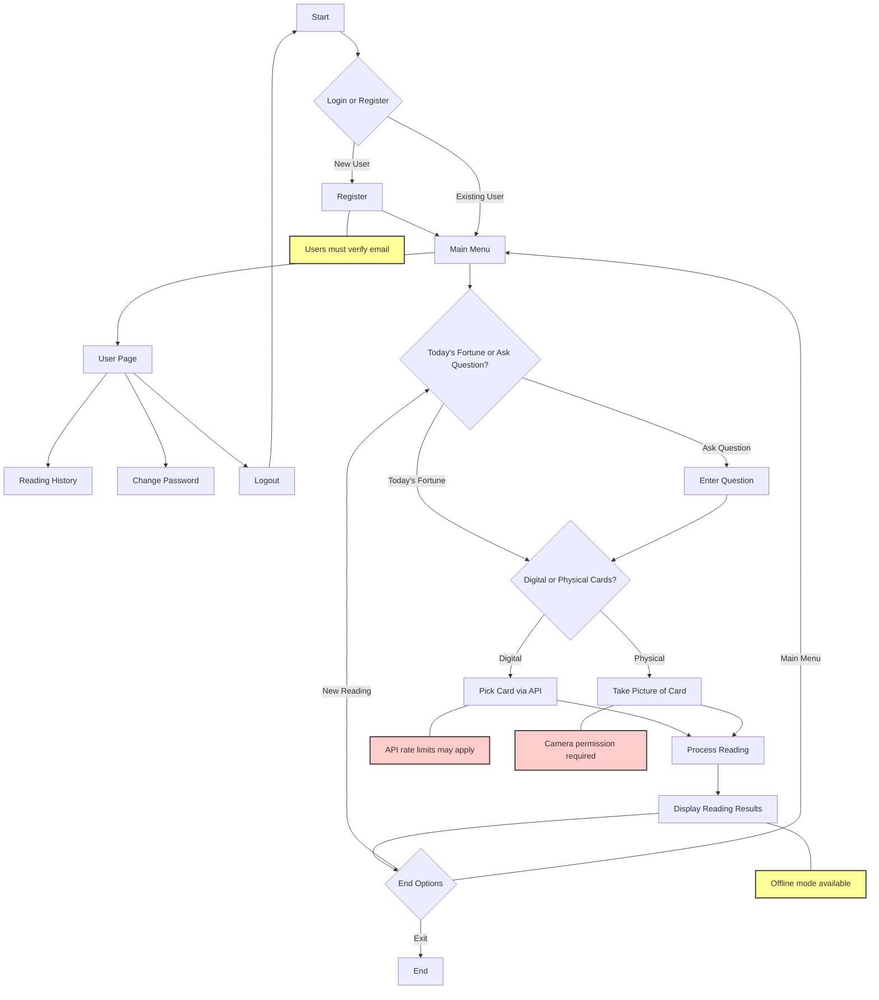

# TarotReading AI

## Why we?

### Bridging Tradition and Technology
TarotReading stands out in the market by solving critical problems in modern tarot reading:


#### 🎯 Unique Market Position
1. **First Physical Card Recognition App**
   - Only app offering real-time tarot card detection
   - Preserves the traditional tactile experience
   - Bridges physical and digital realms

2. **Intelligent Spread Selection**
   - First app to analyze questions and recommend spreads
   - Six specialized patterns for different life situations
   - More accurate than one-size-fits-all approaches

3. **Advanced AI Integration**
   - Leverages GPT-4 for unmatched accuracy
   - Context-aware interpretations
   - Natural, spiritually-aligned responses
     
## Table of Contents
- [User Flow](#user-flow)
- [Features](#features)
- [Installation](#installation)
- [Technical Architecture](#technical-architecture)
- [Development Setup](#development-setup)
- [API Integration](#api-integration)
- [Implementation Details](#implementation-details)
- [Contributing](#contributing)
- [License](#license)

## User Flow



## Features

### 1. Advanced Reading Methods
- **Digital Selection**
  - Intuitive card picking interface
  - Smooth animations
  - Randomized shuffling

- **Physical Card Recognition**
  - Real-time card detection
  - Support for multiple decks
  - High accuracy recognition

### 2. Intelligent Spread Selection
- **Question Analysis**
  - Natural language processing
  - Context understanding
  - Spread recommendation

- **Spread Types**
  ```java
  public enum SpreadType {
      ONECARD,      // Quick insights
      TIMEFLOW,     // Past-Present-Future
      LOVERCROSS,   // Relationships
      SIXSTARS,     // Complex situations
      TWOSELECTION, // Decisions
      MARLBORO      // Future paths
  }
  ```

### 3. AI-Powered Interpretations
- GPT-4 integration
- Context-aware readings
- Natural language responses
- Personalized insights

### 4. User Management
- Secure authentication system
- Profile management
- Reading history
- Password recovery
- Email verification

### 5. Technical Features
- Custom card visualization system
- Real-time camera integration
- Offline mode support
- Secure API integration
- Firebase Firestore backend
  
### 6. Key Innovations

#### 1. Physical Card Integration
```java
// VisionAIHelper.java
public class VisionAIHelper {
    public Task<TarotCard> processImage(InputImage image) {
        // Advanced card recognition
        // Real-time processing
        // High accuracy detection
    }
}
```

#### 2. Dynamic Spread Selection
```java
// TarotPromptBuilder.java
public class TarotPromptBuilder {
    public String buildPrompt(String question, List<Card> cards) {
        // Intelligent spread matching
        // Context analysis
        // Personalized interpretation
    }
}
```

## Installation

1. Clone the repository:
```bash
git clone https://github.com/yunxin119/TarotReading.git
```

2. Configure API key in `local.properties`:
```properties
OPENAI_API_KEY=your_api_key_here
```

3. Install dependencies:
```gradle
dependencies {
    implementation 'com.android.volley:volley:1.2.1'
    implementation 'androidx.appcompat:appcompat:1.6.1'
    implementation 'com.google.android.material:material:1.9.0'
}
```

4. Build and run the project

## Technical Architecture

### Project Structure
```
com.group5.tarotreading/
├── AIAnswerActivity.java        # AI interpretation handling
├── CameraActivity.java         # Camera integration
├── MainActivity.java           # App entry point
├── card/                       # Card Management
│   ├── Card.java              # Card entity
│   ├── CardPick.java          # Selection logic
│   ├── CardPickActivity.java  # Selection UI
│   └── CardPickView.java      # Custom view
├── question/                   # Question Processing
│   ├── AskFragment.java       # Question input
│   ├── QuestionActivity.java  # Question handling
│   └── TodayFragment.java     # Daily readings
├── result/                    # Reading Results
│   ├── AnswerPage.java       # Result display
│   ├── AnswerPageViewModel.java
│   ├── TarotPromptBuilder.java
│   └── TarotResponse.java
├── user/                      # User Management
│   ├── ChangePasswordActivity.java
│   ├── LoginActivity.java
│   ├── RegisterActivity.java
│   └── UserProfile.java
└── utils/                     # Utilities
    ├── OpenAIHelper.java     # GPT-4 integration
    └── VisionAIHelper.java   # Image processing
```

### Core Components
1. **CardPickView**: Custom view for card interaction
2. **OpenAIHelper**: GPT-4 integration
3. **VisionAIHelper**: Camera processing
4. **UserProfile**: User management
5. **TarotPromptBuilder**: Reading generation

## API Integration

### OpenAI GPT-4 Configuration
```java
JSONObject jsonObject = new JSONObject();
jsonObject.put("model", "gpt-4");
jsonObject.put("temperature", 0);
jsonObject.put("max_tokens", 300);
```

### Request Headers
```java
Map<String, String> params = new HashMap<>();
params.put("Content-Type", "application/json");
params.put("Authorization", "Bearer " + apiKey);
```

## Implementation Details

### Card Selection System
```java
public class CardPickView extends View {
    private List<Card> cardList;
    private float overlapAmount = 100f;
    private GestureDetector gestureDetector;
    
    @Override
    protected void onDraw(Canvas canvas) {
        // Card rendering logic
    }
}
```

### Authentication Flow
```java
private void SaveDataToNewDocument() {
    Map<String, Object> user = new HashMap<>();
    user.put("username", username);
    user.put("email", email);
    user.put("password", password);
    
    collectionReference.add(user)
        .addOnSuccessListener(documentReference -> {
            String docId = documentReference.getId();
        });
}
```

## Contributing

1. Fork the repository
2. Create your feature branch
3. Commit your changes
4. Push to the branch
5. Create a Pull Request

## License

This project is licensed under the MIT License - see the [LICENSE.md](LICENSE.md) file for details.


