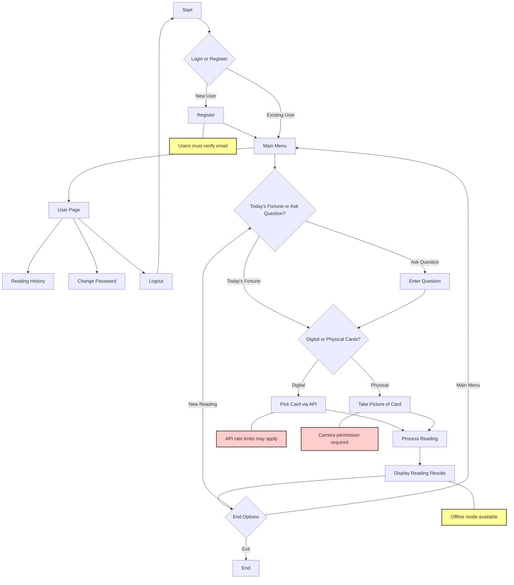

# TarotReading App

A modern Android application that combines traditional tarot card reading with AI-powered interpretations using GPT-4. The app supports both digital card selection and physical card recognition through the device's camera.


## Table of Contents
- [Overview](#overview)
- [User Flow](#user-flow)
- [Features](#features)
- [Installation](#installation)
- [Technical Architecture](#technical-architecture)
- [Development Setup](#development-setup)
- [API Integration](#api-integration)
- [Implementation Details](#implementation-details)
- [Contributing](#contributing)
- [License](#license)
- [Support](#support)

## Overview

TarotReading is a sophisticated Android application that merges traditional tarot reading practices with modern AI technology. The app provides users with both digital and physical card reading capabilities, powered by GPT-4 for intelligent interpretations.

## User Flow



## Features

### 1. Multiple Reading Methods
- Digital card selection with intuitive UI
- Physical card recognition using device camera
- Various spread patterns:
  - OneCard (Daily reading)
  - TimeFlow (Past-Present-Future)
  - LoverCross (Relationship analysis)
  - SixStars (Comprehensive analysis)
  - TwoSelection (Decision making)
  - Marlboro (Situation development)

### 2. AI-Powered Interpretations
- GPT-4 integration for accurate readings
- Context-aware interpretations
- Natural language processing
- Personalized reading experiences

### 3. User Management
- Secure authentication system
- Profile management
- Reading history
- Password recovery
- Email verification

### 4. Technical Features
- Custom card visualization system
- Real-time camera integration
- Offline mode support
- Secure API integration
- Firebase Firestore backend

## Installation

1. Clone the repository:
```bash
git clone https://github.com/yunxin119/TarotReading.git
```

2. Configure API key in `local.properties`:
```properties
OPENAI_API_KEY=your_api_key_here
```

3. Install dependencies:
```gradle
dependencies {
    implementation 'com.android.volley:volley:1.2.1'
    implementation 'androidx.appcompat:appcompat:1.6.1'
    implementation 'com.google.android.material:material:1.9.0'
}
```

4. Build and run the project

## Technical Architecture

### Project Structure
```
src/main/java/com/group5/tarotreading/
├── activity/                    # Core Activities
├── card/                        # Card Management
├── question/                    # Question Processing
├── result/                      # Result Display
├── user/                        # User Management
└── utils/                       # Utilities
```

### Core Components
1. **CardPickView**: Custom view for card interaction
2. **OpenAIHelper**: GPT-4 integration
3. **VisionAIHelper**: Camera processing
4. **UserProfile**: User management
5. **TarotPromptBuilder**: Reading generation

## API Integration

### OpenAI GPT-4 Configuration
```java
JSONObject jsonObject = new JSONObject();
jsonObject.put("model", "gpt-4");
jsonObject.put("temperature", 0);
jsonObject.put("max_tokens", 300);
```

### Request Headers
```java
Map<String, String> params = new HashMap<>();
params.put("Content-Type", "application/json");
params.put("Authorization", "Bearer " + apiKey);
```

## Implementation Details

### Card Selection System
```java
public class CardPickView extends View {
    private List<Card> cardList;
    private float overlapAmount = 100f;
    private GestureDetector gestureDetector;
    
    @Override
    protected void onDraw(Canvas canvas) {
        // Card rendering logic
    }
}
```

### Authentication Flow
```java
private void SaveDataToNewDocument() {
    Map<String, Object> user = new HashMap<>();
    user.put("username", username);
    user.put("email", email);
    user.put("password", password);
    
    collectionReference.add(user)
        .addOnSuccessListener(documentReference -> {
            String docId = documentReference.getId();
        });
}
```

## Contributing

1. Fork the repository
2. Create your feature branch
3. Commit your changes
4. Push to the branch
5. Create a Pull Request

## License

This project is licensed under the MIT License - see the [LICENSE.md](LICENSE.md) file for details.

## Support

For support, please:
- Open an issue in the repository
- Contact the development team at [support@tarotreading.com](mailto:support@tarotreading.com)
- Check our [Documentation Wiki](https://github.com/yunxin119/TarotReading/wiki)
